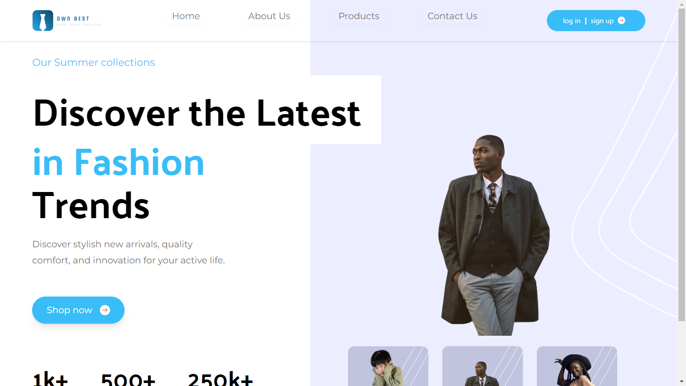

# own-best-E-commerce-project

<h2 [own your fashion]彡★ </h2>


# E-Commerce Project with mock api

## Introduction
Welcome to the E-Commerce Project repository! This project is an e-commerce website built using React with Vite and Tailwind CSS. It provides a platform for users to browse, search, and purchase products online. 

### Links
- https://ownbest.netlify.app/

## Installation
To get started with the project, follow these steps:
1. Clone the repository to your local machine:
   ```bash
   git clone https://github.com/your-username/E-Commerce-Project.git
   ```
2. Navigate into the project directory:
   ```bash
   cd E-Commerce-Project
   ```
3. Install dependencies using npm or yarn:
   ```bash
   npm install
   # or
   yarn install
   ```

## Usage
Once the installation is complete, you can start the development server:
```bash
npm run dev
# or
yarn dev
```
This will launch the application in your default browser. You can then browse the website, search for products, and make purchases.

## Contributing
Contributions are welcome! If you'd like to contribute to this project, please follow these steps:
1. Fork the repository.
2. Create a new branch for your feature or bug fix: `git checkout -b feature-name`.
3. Make your changes and commit them: `git commit -m 'Add new feature'`.
4. Push to the branch: `git push origin feature-name`.
5. Submit a pull request.

## Related Projects
Check out these related projects:
- https://ermii-tekk.github.io/e-shopping

## Screenshots

---
enjoy it
